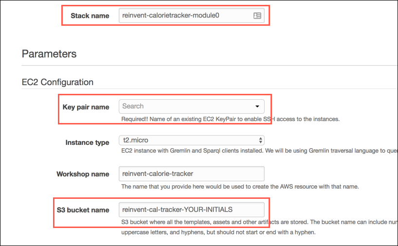

# Module 0: Deploying Amazon Neptune Cluster

In this section, we will create:

- Amazon Neptune Cluster in a private subnet within Amazon Virtual Private Cloud (VPC)
- An IAM Role to load the given dataset from Amazon S3 into Amazon Neptune. Loading data from an Amazon S3 bucket requires an AWS Identity and Access Management (IAM) role that has access to the bucket. Amazon Neptune assumes this role in order to load the data.
- S3 bucket to copy the given dataset files.
- An EC2 instance with Gremlin and Sparql clients installed. We will be using Gremlin traversal language to query the graph. 
- A **suggest-food-for-user** lambda function deployed in a VPC that provides food suggestions based on user activities and personal information such as BMI.

In order to ease the workshop, we have created a CloudFormation template that deploys the above resources. Please note for this workshop, we will be using the **Ireland (eu-west-1)** region

-----
## Deploy the Cloudformation Stack

Use the following link to deploy the stack. 

Region| Launch
------|-----
eu-west-1 (Ireland) | [](https://eu-west-1.console.aws.amazon.com/cloudformation/home?region=eu-west-1#/stacks/new?stackName=reinvent-calorietracker-module0&templateURL=https://s3.eu-west-1.amazonaws.com/reinvent-calorie-tracker-workshop/0_NEPTUNE/templates/main.yaml)

---
 #### Cloudformation Inputs:
- Please provide the Stack Name
- Update the following `EC2 Configuration` section under `Parameters`
  - Specify the SSH keyPair name. If you do not have one, please [create a new KeyPair](https://docs.aws.amazon.com/AWSEC2/latest/UserGuide/ec2-key-pairs.html#having-ec2-create-your-key-pair) from within EC2 console.
  - Please provide the S3 Bucket Name. This needs to be a unique name.
  - Keep the rest as default and create the stack

  

- Click next and under `Capabilities`, check both the boxes and click `Crate Change Set` under Transform. Then click `Next`

  

Once the stack has been successfully deployed, the cloudformation will print all the resource details in the `Output` section:

  

You could also use the AWS CLI to fetch these details by running:

```bash
$ aws cloudformation describe-stacks --stack-name your-stack-name --query 'Stacks[0].Outputs'
``` 

---

Next, we will be setting up the [AWS Cloud9 environment](../1_AWS_Cloud9/README.md)

[Go back to the home page](../README.md)