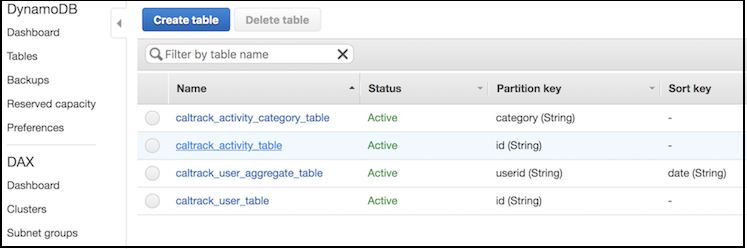
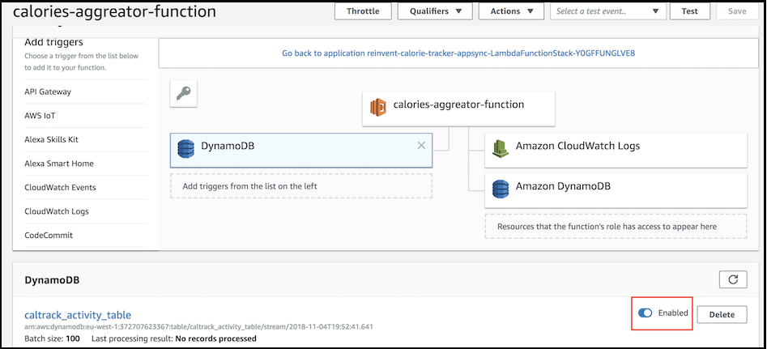
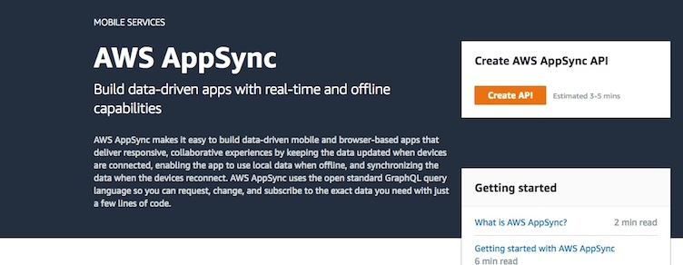
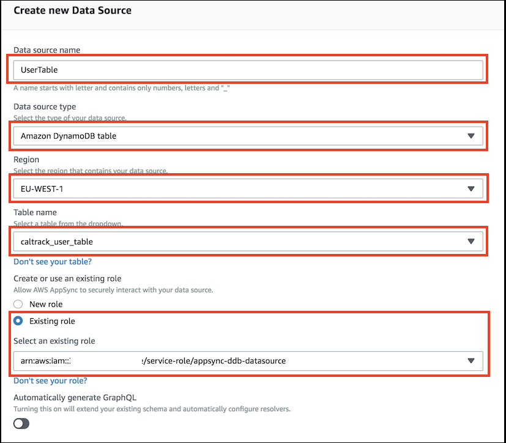
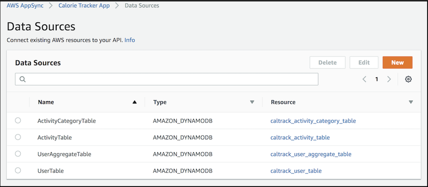
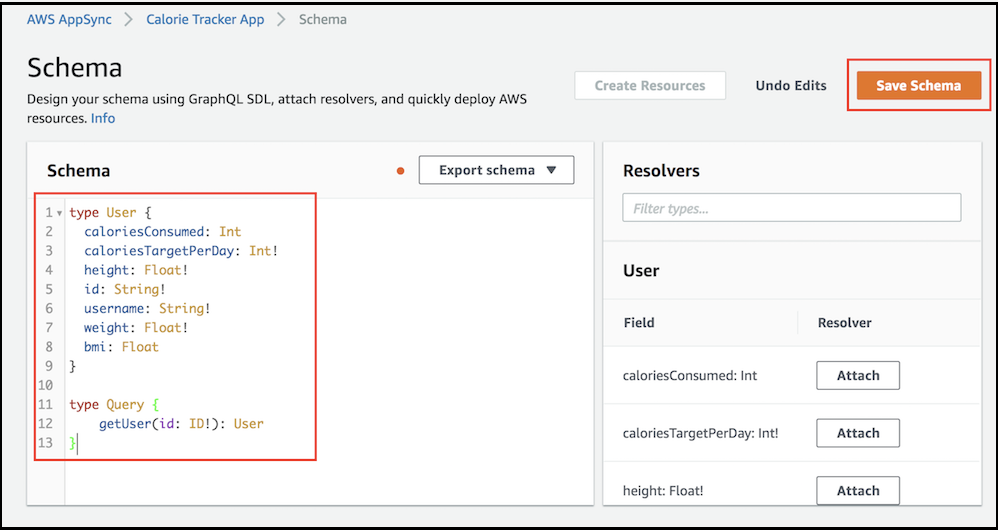
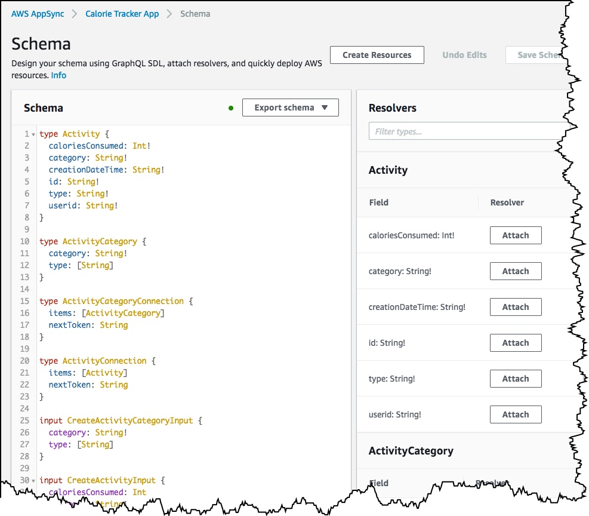
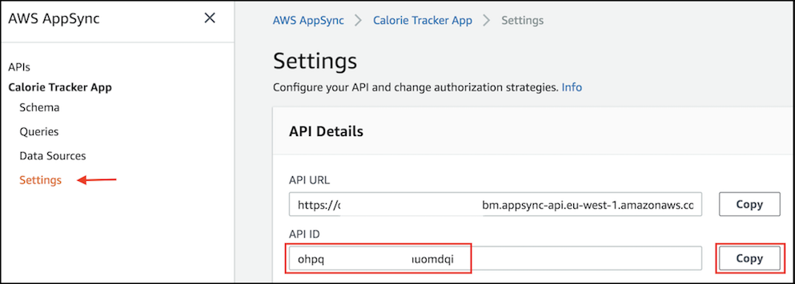
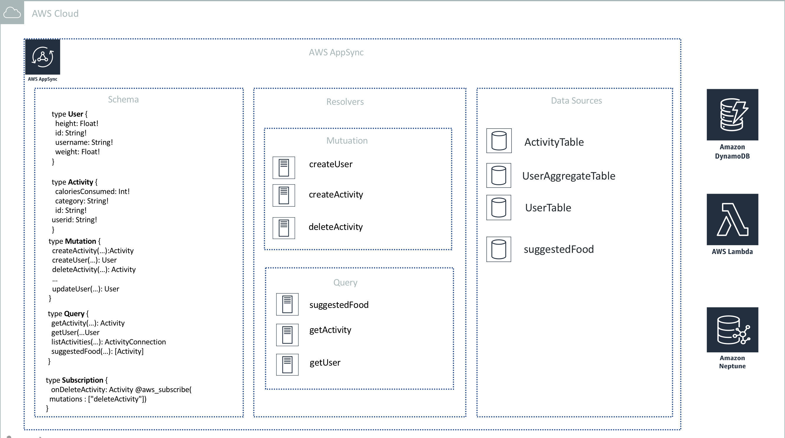

# Module 2: Create DynamoDB tables and AppSync backend

In this section, we will create the backend for our application. We will use Amazon DynamoDB to store user information and AWS AppSync to create GraphQL based backend.

To simplify the process, we will use AWS CloudFormation templates to create different resources for our application backend.

Steps:
- [1. Create DynamoDB Tables and Lambda function](#step-1-create-dynamodb-tables-and-lambda-function)
- [2. Create AppSync API backend](#step-2-create-appsync-api-backend)
  - [2.1 Setup data sources](#21-setup-data-sources)
  - [2.2 Setup AppSync Schema](#22-setup-appsync-schema)
  - [2.3 Configure resolvers](#23-configure-resolvers)
 - [3. Setup Lambda event source](#step-3-add-amazon-dynamodb-user-table-as-event-source-for-add-new-user-bmi-lambda)

For each of the above steps we have separate CloudFormation templates, however, you can deploy all the resources with one-click using the master template below. Use it only if you want to save time.

<details>
<summary><b>AWS AppSync Master CloudFormation  template</b></summary><p>

Region| Launch
------|-----
eu-west-1 (Ireland) | [](https://eu-west-1.console.aws.amazon.com/cloudformation/home?region=eu-west-1#/stacks/new?stackName=reinvent-calorie-tracker-module3&templateURL=https://s3-eu-west-1.amazonaws.com/reinvent-calorie-tracker-workshop/2_APPSYNC/templates/master.yaml)

Once the Cloudformation stack has completed, go to your `AWS Cloud9 terminal`, type the following command to load the sample activity categories (Make sure you are at the right directory):

```
aws dynamodb batch-write-item --request-items file://2_APPSYNC/assets/activity-categories.json --region eu-west-1
```


Next, go to [3. Setup Lambda event source](#step-3-add-amazon-dynamodb-user-table-as-event-source-for-add-new-user-bmi-lambda)

</p></details>

-----

### Step 1: Create DynamoDB Tables and Lambda function

In this step, we will create 4 DynamoDB tables and a Lambda function using CloudFormation template. 

- DynamoDB tables are used to store user information and Lambda function is used to aggregate the user calories based on the user activities and update it in User Aggregate table. 
- If the activity category is either Food or Drink, it will add the calories to the 'caloriesConsumed' field for the user. 
- If the activity category is Exercise, it will add the calories to the 'caloriesBurned' field for the user.
- The Lambda function will be executed every time user logs an activity in the app, using User activity DynamoDB stream.

Use the following link to deploy the stack. 

Region| Launch
------|-----
eu-west-1 (Ireland) | [](https://eu-west-1.console.aws.amazon.com/cloudformation/home?region=eu-west-1#/stacks/new?stackName=reinvent-calorie-tracker-module3&templateURL=https://s3-eu-west-1.amazonaws.com/reinvent-calorie-tracker-workshop/2_APPSYNC/templates/dynamodb-lambda.yaml)


> Leave all Cloudformation inputs as defaults and click Next and Create the Stack

When the stack creation is completed successfully, you will have following 4 tables and a Lambda function created. You can check the status of your stack from the CloudFormation console.

- caltrack_user_table
- caltrack_activity_table
- caltrack_activity_category_table
- caltrack_user_aggregate_table





Next, go to your `AWS Cloud9 terminal`, type the following command to load the sample activity categories (Make sure you are at the right directory):

```
aws dynamodb batch-write-item --request-items file://2_APPSYNC/assets/activity-categories.json --region eu-west-1
```


### Step 2: Create AppSync API backend
Now, we will use the DynamoDB tables created in Step 1 to create GraphQL backend. 

Open the AWS AppSync Console and click **Create API**.



Choose **Build from Scratch** and click **Start**.


Enter a name for your API `Calorie Tracker App` and click **Create**.


#### 2.1 Setup data sources
We will be using DynamoDB as our data sources. We will create 4 data sources, one for each DynamoDB table.


**UserTable data source**

On the left pane, select **Data Sources**. Click **Create data source**. Fill the details as provided below and click **Create**.
- Data source name: **UserTable**
- Data source type: **Amazon DynamoDB table**
- Region: **EU-WEST-1**
- Table name: **caltrack_user_table**
- Use an Existing Role: **appsync-ddb-datasource**



**ActivityTable data source**

Click **Create data source**. Fill the details as provided below and click **Create**.
- Data source name: **ActivityTable**
- Data source type: **Amazon DynamoDB table**
- Region: **EU-WEST-1**
- Table name: **caltrack_activity_table**
- Use an Existing Role: **appsync-ddb-datasource**

**UserAggregateTable data source**

Click **Create data source**. Fill the details as provided below and click **Create**.
- Data source name: **UserAggregateTable**
- Data source type: **Amazon DynamoDB table**
- Region: **EU-WEST-1**
- Table name: **caltrack_user_aggregate_table**
- Use an Existing Role: **appsync-ddb-datasource**

**ActivityCategoryTable data source**

Click **Create data source**. Fill the details as provided below and click **Create**.
- Data source name: **ActivityCategoryTable**
- Data source type: **Amazon DynamoDB table**
- Region: **EU-WEST-1**
- Table name: **caltrack_activity_category_table**
- Use an Existing Role: **appsync-ddb-datasource**

Once you have created the datasources, you should see 4 Appsync Datasources in the console. 



#### 2.2 Setup AppSync Schema
In this section we will create a GraphQL Schema. In the following first few steps, we will show you how to create type, query and mutations from scratch. But, in the interest of time, we have the GrapphQL schema pre-created for you, which you can directly copy and paste in your schema editor.
- On the left pane, select **Schema**.
  ##### Create Type - User
  - First, we will create a **User** type which will contain the attributes we want to store in DynamoDB table for each user. 
	```
	  type User {
	    caloriesConsumed: Int
	    caloriesTargetPerDay: Int!
	    height: Float!
	    id: String!
	    username: String!
	    weight: Float!
	    bmi: Float
	  }
	  ```
  ##### Create Query - getUser
  - Now we will create a Query type **getUser** to fetch user details based on the User Id. The query **getUser** take **ID** as input argument and returns **User** type.
	 ```
	 type Query {
	      getUser(id: ID!): User
	  }
	 ```
  ##### Create Mutation - createUser
    - Let's create a Mutation type **createUser**. This mutation will be used by our app to store user information.
    - To create **createUser** mutation type, copy the text from below and paste it in your AppSync Schema.
    - The mutation **createUser** takes **CreateUserInput** as input argument and return **User** type. **CreateUserInput** is an Input type which contains the attributes we want to store for each user.
	 ```
	  type Mutation {
	    createUser(input: CreateUserInput!): User
	  }
	
	  input CreateUserInput {
	    id: String
	    caloriesConsumed: Int
	    caloriesTargetPerDay: Int!
	    height: Float!
	    username: String!
	    weight: Float!
	  }
	 ```
  Your AppSync Schema should look like below. Click `Save` to save your schema.
  ```
  type User {
    caloriesConsumed: Int
    caloriesTargetPerDay: Int!
    height: Float!
    id: String!
    username: String!
    weight: Float!
    bmi: Float
  }

  type Query {
      getUser(id: ID!): User
  }

  type Mutation {
    createUser(input: CreateUserInput!): User
  }

  input CreateUserInput {
    id: String
    caloriesConsumed: Int
    caloriesTargetPerDay: Int!
    height: Float!
    username: String!
    weight: Float!
  }

  ```
    

- We have pre-created the overall schema of our application. Copy the contents of the **2_APPSYNC/assets/schema.graphql** file, select all in your Schema editor and paste the schema, then click **Save**.

  

- At this point, you have your GraphQL schema ready for your app, but we do not have the resolvers configured. In next section, we will configure resolvers for our types.

#### 2.3 Configure resolvers

> GraphQL resolvers connect the fields in a type's schema to a data source. Resolvers are the mechanism by which requests are fulfilled. Resolvers in AWS AppSync use mapping templates written in Apache Velocity Template Language (VTL) to convert a GraphQL expression into a format the data source can use

We will configure query, mutation and subscription resolvers in this step. 

> Make a note of your AppSync API ID.
>- On the left page, select **Settings**.
>- Click **Copy** button next to the API ID field.

  

Use the following link to deploy the stack. 

Region| Launch
------|-----
eu-west-1 (Ireland) | [](https://eu-west-1.console.aws.amazon.com/cloudformation/home?region=eu-west-1#/stacks/new?stackName=reinvent-cal-tracker-resolver&templateURL=https://s3-eu-west-1.amazonaws.com/reinvent-calorie-tracker-workshop/2_APPSYNC/templates/appsync-resolvers.yaml)

 - Paste the API ID for the *AppSyncAPIId* parameter value.

  	

- When the CloudFormation stack is completed successfully, you will have your resolvers configured.

  

---

### Step 3: Add Amazon DynamoDB (user-table) as Event Source for `add-new-user-bmi` Lambda

When a new user signup, the app captures their height and weight. Using this, we need to calculate their BMI which will be used later to provide diet suggestions. 

In this step, we will configure Amazon DynamoDB as an event source to `add-new-user-bmi` Lambda function.

- Go to AWS Lambda console.
- Click **add-new-user-bmi** function.
- Under **triggers** in the left pane, select **DynamoDB**
- Select `DynamoDB` in the center pane, scroll down to `Configure trigger` section

  

- Select `caltrack_user_table` as DynamoDB Table
- Leave the batch size as default
- Starting position as `Latest`
- Ensure `Enable trigger` is checked and click `Add`

  

- Click `Save`

  

You have successfully configured DynamoDB as an event source for the Lambda function.

---

## Summary
**Congratulations!!** You have successfully created DynamoDB tables, Lambda function and AWS AppSync GraphQL backend.

AppSync is setup to use DynamoDB tables as data sources to persist user information. The below picture shows the relationalship between Appsync Schema, resolver and Datasources.



We also configured DynamoDB as event source on **add-new-user-bmi** Lambda function.

[Next - Let's setup the frontend VueJS application](../3_FRONTEND_APP/README.md)

[Back to home page](../README.md)
