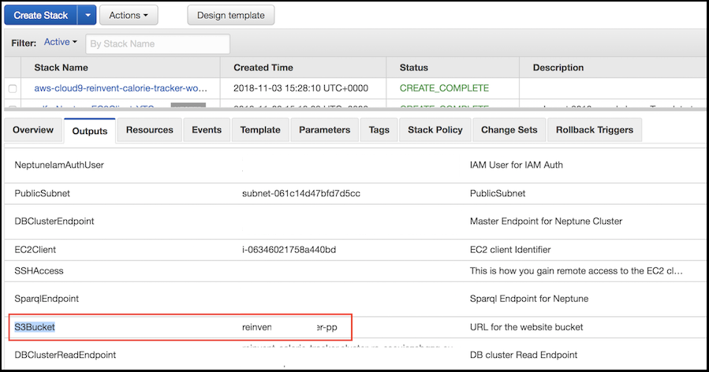
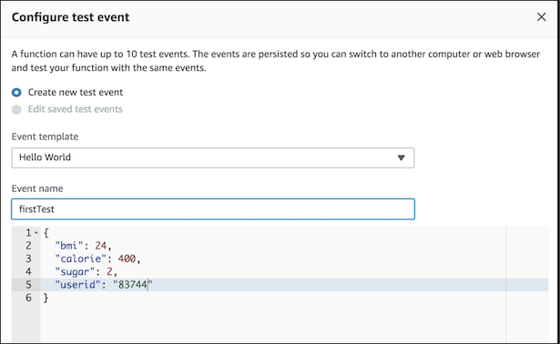

# Module 2: Loading the dataset

Now that you have got an Amazon Neptune cluster and AWS Cloud9 environment setup, lets clone the project and load the dataset into our Neptune Cluster.

-----

Steps:
- [1.1. Cloning the project](#11-Cloning-the-project)
- [1.2. Copy the dataset files to Amazon S3 bucket](#12-Copy-the-dataset-files-to-S3)
- [1.3. Creating S3 VPC Endpoint](#13-Creating-Amazon-S3-VPC-Endpoint)
- [1.4. Loading the dataset into Neptune](#14-Loading-the-given-food-dataset-into-Amazon-Neptune)
- [1.5. Food-Suggestor Lambda function](#15-Food-Suggestor-lambda-function)

## 1.1. Cloning the project

Within your `AWS Cloud9 environment`, run the following commands to copy the zip file containing the workshop artifacts from S3 to Cloud9 environment, and unzip it.

```
wget https://s3-us-west-2.amazonaws.com/calorie-test/aws-appsync-calorie-tracker-workshop.zip
unzip aws-appsync-calorie-tracker-workshop.zip
rm -rf __MACOSX/
rm aws-appsync-calorie-tracker-workshop.zip
cd aws-appsync-calorie-tracker-workshop

```
> Internal Note: The above steps will be replaced once we get the public github repo published.

  

-----

## 1.2. Copy the dataset files to S3 bucket

- The `datasets` files can be found under `2_LOAD_DATA/datasets` folder.

  

- Copy both `food_edges` and `vertex.csv` to the bucket that was created as part of the Cloudformation Stack. To get the `bucket name` go to Cloudformation output section and make a note of the S3Bucket

  

- Within your Cloud terminal, run the following command. Make sure you replace the YOUR_BUCKET_NAME_HERE with the S3 Bucket name from previous step.
```
aws s3 cp 2_LOAD_DATA/datasets/ s3://YOUR_BUCKET_NAME_HERE/ --recursive
```
  
------

## 1.3. Creating Amazon S3 VPC Endpoint

> Amazon Neptune provides a process for loading data from external files directly into a Neptune DB instance. The Neptune Loader command is faster, has less overhead, is optimized for large datasets, and supports both RDF (Resource Description Framework) and Gremlin data. The Neptune loader requires a VPC endpoint for Amazon S3.

1. Sign in to the AWS Management Console and open the Amazon VPC console at https://console.aws.amazon.com/vpc/.

2. In the left navigation pane, choose Endpoints.

3. Choose Create Endpoint.

4. Choose the Service Name `com.amazonaws.eu-west-1.s3`.

5. Choose the VPC that contains your Neptune DB instance.

6. Select the route tables that are associated with the private subnet related to your cluster.

  

7. Under `Policy`, select `custom`, copy and paste the following policy. Make sure you replace the YOUR_BUCKET_NAME_HERE with the S3 Bucket name from step 1.2.

  ```json
{
    "Version": "2012-10-17",
    "Statement": [
        {
            "Effect": "Allow",
            "Principal": "*",
            "Action": [
                "s3:GetObject",
                "s3:PutObject",
                "s3:ListBucket",
                "s3:GetBucketLocation"
            ],
            "Resource": [
                "arn:aws:s3:::YOUR_BUCKET_NAME_HERE",
                "arn:aws:s3:::YOUR_BUCKET_NAME_HERE/*"
            ]
        }
    ]
}
  ```

8. Create Endpoint.

----------

## 1.4. Loading the given food dataset into Amazon Neptune

In this workshop, we are using the Health and Nutrition Dataset provided by the [Center for Disease Control and Preventation](https://wwwn.cdc.gov/nchs/nhanes/search/datapage.aspx?Component=Dietary&CycleBeginYear=2015). NHANES conducts studies designed to assess the health and nutritional status of adults and children in the United States. The survey is unique in that it combines interviews and physical examinations.

The datasets that needs to be loaded into Amazon Neptune are available under the `datasets` folder.

- `Vertex.csv` contains userId, demographics information about the user such as weight (kg), height (cm) and their BMI.

- `food_edges.txt` contains the gremlin queries that creates the edges/relationships between the vertices.
-----

Step 1: Go to `EC2 console` and SSH into the EC2 instance named `Neptune-reinvent-calorie-tracker` and copy the below curl command

> Replace the `neptune loader endpoint`, `source S3` and `IAM Role ARN`. You can find these in `reinvent-calorietracker-workshop` Cloudformation outputs


```
curl -X POST \
    -H 'Content-Type: application/json' \
    http://your-neptune-endpoint:8182/loader -d '
    {
      "source" : "s3://<your-bucket-name>/vertex.csv",
      "iamRoleArn" : "arn:aws:iam::account-id:role/role-name",
      "format" : "csv",
      "region" : "eu-west-1",
      "failOnError" : "FALSE"
    }'
```


---
You can check the status of your load with the following command. Ensure the `status` is **LOAD_COMPLETED** as shown in the picture below

```
curl http://your-neptune-endpoint:8182/loader?loadId=[loadId value]
```


Step 2: Next, copy and paste the following into `EC2 terminal`

```
cd apache-tinkerpop-gremlin-console-3.3.2
bin/gremlin.sh
:remote connect tinkerpop.server conf/neptune-remote.yaml
:remote console
```


Step 3:  In **Step 1**, we loaded all the vertices. Here we would be creating the edges or relationship between the person, actvity and the food they consumed.

Copy and paste all the queries from `2_LOAD_DATA/datasets/food_edges.txt` into the gremlin console


---
### Test the gremlin queries:

Query 1: Prints all the Vertices
```
gremlin> g.V().count()
==>80
```

> IMPORTANT: In case the count is not 80, please make sure `Step 3` under 1.4 is executed correctly.

Query 2: Returns the list of users whose BMI < 24

```
gremlin> g.V().has('bmi',lte(24))
==>v[83740]
==>v[83739]
==>v[83748]
==>v[83760]
==>v[83738]
==>v[83751]
==>v[83756]
```

**Sample some of the edges (limit 5)**
```
gremlin> g.E().limit(5)
==>e[2eb368d5-b6b9-7e5b-8842-4b279c41489b][83744-has->Dinner]
==>e[56b368d5-b6f4-2021-2d1e-128ddfa2db91][83745-has->Lunch]
==>e[34b368d5-b6f5-ac2f-7edf-2498d19004e3][Lunch-eats->4eb368d5-b6f4-b035-d5e2-376d083f1d82]
==>e[22b368d5-b6c3-74f7-04d0-b24bbaa54dfb][Dinner-eats->98b368d5-b6c0-3903-407a-f84d3f243720]
```

Can you write a gremlin query to get the names of food consumed by one of the user/person say userid=83744

```
gremlin> g.V("83744").out('has').out('eats').values('name')
==> Sandwiches combined with Coffee, tea with: milk, cream, sugar
```

----

## 1.5. Food-Suggestor lambda function.

Under AWS lambda, you will find a Lambda function named `suggest-food-for-user
`. This is essentially running the following gremlin query where:

- gremlin is traversing the vertex with label `person` and has a property `bmi` less than or equal to 24.
- Get the outgoing traversal with edges as `has` and label it as `food`.
- In the same way, get the outgoing traversal with edges as `eats`.
- Then we filter the results where calories is less than 400, sugar is less than 2 gm, return the `name` of food types that match this criteria and label the output as `type`.
- Select the objects labels `food` and `type` from the path and remove (`dedup`) any repeated items.

```

g.V().has('person','bmi',lte(24)).out('has').id().as('food').out('eats').filter(values('calorie').is(lt(400))).filter(values('sugar').is(lt(2))).values('name').as('type').select('food','type').dedup()

```


- In order to test this Lambda function, copy the following as test input

```
{
  "bmi": 24,
  "calorie": 400,
  "sugar": 2,
  "userid": "83740"
}
```


- Enter a new event name and click `create`.



- Test the lambda function which should return a list of suggested food based on the given BMI


---

Congratulations!!!  You have successfully completed creating an Amazon Neptune Cluster, loaded the given dataset from S3 using Amazon S3 VPC endpoint, ran Gremlin queries and have tested the foodSuggestor lambda function.

Next, lets configure [AWS Appsync](../3_APPSYNC/README.md)

[Back to home page](../README.md)
