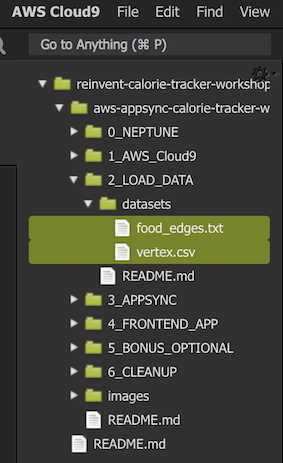
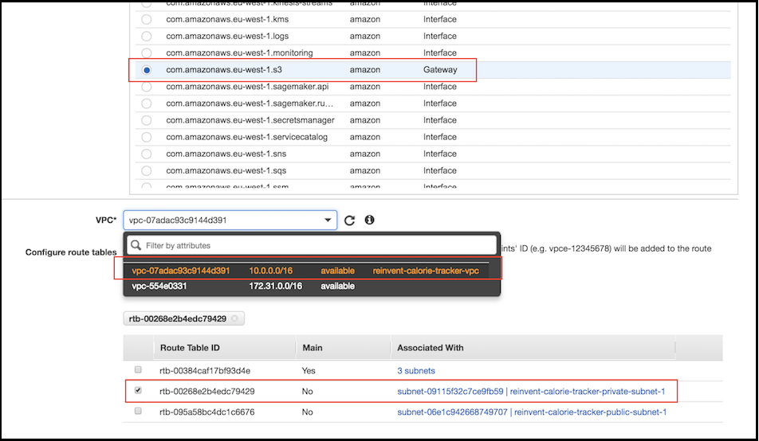
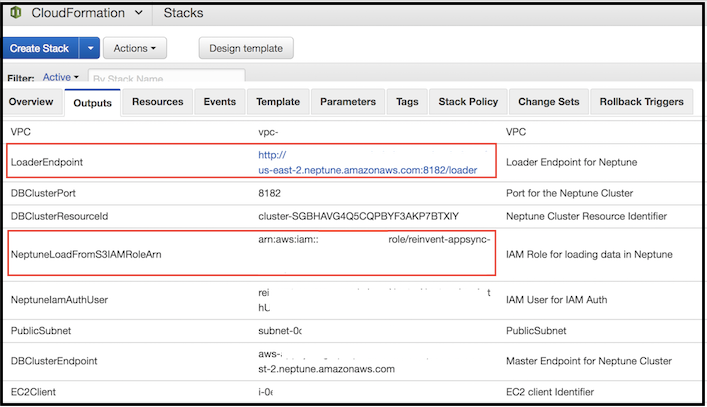
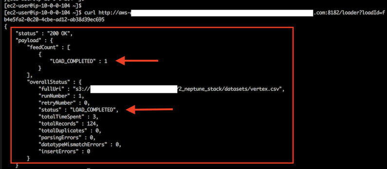
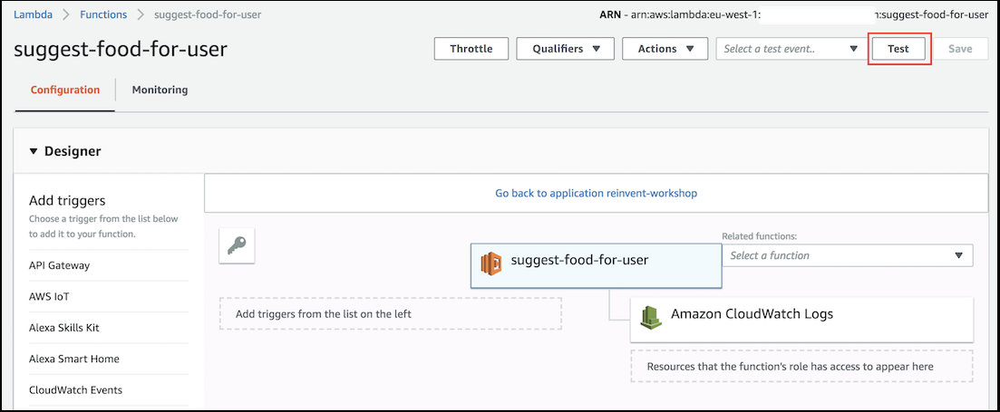

# Deploying Amazon Neptune Cluster

In this section, we will create:

- Amazon Neptune Cluster in a private subnet within Amazon Virtual Private Cloud (VPC)
- An IAM Role to load the given dataset from Amazon S3 into Amazon Neptune. Loading data from an Amazon S3 bucket requires an AWS Identity and Access Management (IAM) role that has access to the bucket. Amazon Neptune assumes this role in order to load the data.
- An EC2 instance with Gremlin and Sparql clients installed. We will be using Gremlin traversal language to query the graph. 
- A **suggestFood** lambda function deployed in a VPC that provides food suggestions based on user activities and personal information such as BMI.

In order to ease the workshop, we have created a CloudFormation template that deploys the above resources.

-----

Steps:
- [1.1. Deploy the Cloudformation Stack](#11-Deploy-CloudFormation-Stack)
- [1.2. Git Clone the project](#12-Git-Clone)
- [1.3. Creating S3 bucket](#13-Creating-S3-bucket)
- [1.4. Creating S3 VPC Endpoint](#14-Creating-Amazon-S3-VPC-Endpoint)
- [1.5. Loading the dataset into Neptune](#15-Loading-the-given-food-dataset-into-Amazon-Neptune)
- [1.6. FoodSuggestor Lambda function](#16-FoodSuggestor-lambda-function)

-----
## 1.1. Deploy the Cloudformation Stack

Use the following link to deploy the stack. 

Region| Launch
------|-----
us-east-2 | [](https://us-east-2.console.aws.amazon.com/cloudformation/home?region=us-east-2#/stacks/new?stackName=[reinvent-appsync-workshop]&templateURL=https://s3.us-east-2.amazonaws.com/reinvent-appsync-workshop-ohio/2_neptune_stack/templates/main.yaml)


- Provide the Stack Name
- Specify the SSH keyPair name. If you do not have one, please [create a new KeyPair](https://docs.aws.amazon.com/AWSEC2/latest/UserGuide/ec2-key-pairs.html#having-ec2-create-your-key-pair) from within EC2 console.

## 1.2. Git Clone the project

Go to Cloud9 terminal, please clone the github repo:

> Internal Note: the above github link will be replaced with public github repo

Either clone this project locally

``` 
git clone ssh://git.amazon.com/pkg/Jupitera-calorie-tracker -b draft
```

OR

copy the following S3 zip into your Cloud9 environment and unzip it.


-----

## 1.3. Creating S3 bucket

Next, lets create an S3 bucket and copy the given datasets into the bucket

- Create an S3 bucket in `us-east-2 / US East (Ohio)` region. 

In case you are using the Cloud9 terminal, paste the following command to create S3 bucket. Please make sure you provide `a bucket name`.
```
aws s3api create-bucket --bucket <provide-an-unique-bucket-name> --region us-east-2
```

<details>
<summary><strong>
In case you run into any error creating an S3 bucket via s3api (expand for details)
</strong></summary>

```
aws s3api create-bucket --bucket <bucket-name> --region us-east-2 --create-bucket-configuration LocationConstraint=us-east-2 { "Location": "http://<bucket-name>.s3.amazonaws.com/" }
```

</details>

- Copy the `datasets` folder under `2_neptune_stack` into your newly created S3 bucket.



```
aws s3 cp 2_neptune_stack/datasets/ s3://<your-bucket-name>/ --recursive
```

------

## 1.4. Creating Amazon S3 VPC Endpoint

> Amazon Neptune provides a process for loading data from external files directly into a Neptune DB instance. The Neptune Loader command is faster, has less overhead, is optimized for large datasets, and supports both RDF (Resource Description Framework) and Gremlin data. The Neptune loader requires a VPC endpoint for Amazon S3.


1. Sign in to the AWS Management Console and open the Amazon VPC console at https://console.aws.amazon.com/vpc/.

2. In the left navigation pane, choose Endpoints.

3. Choose Create Endpoint.

4. Choose the Service Name `com.amazonaws.region.s3`.

> Note:
>   Please make sure you choose the correct AWS region is correct.

5. Choose the VPC that contains your Neptune DB instance.

6. Select the check box next to the route tables that are associated with the subnets related to your cluster. If you only have one route table, you must select that box.



7. Under `Policy`, copy the following

```json
{
    "Version": "2012-10-17",
    "Statement": [
        {
            "Effect": "Allow",
            "Principal": "*",
            "Action": "s3:*",
            "Resource": "*"
        }
    ]
}

```

8. Choose Create Endpoint.

----------

## 1.5. Loading the given food dataset into Amazon Neptune

In this workshop, we are using the Health and Nutrition Dataset provided by the [Center for Disease Control and Preventation](https://wwwn.cdc.gov/nchs/nhanes/search/datapage.aspx?Component=Dietary&CycleBeginYear=2015). NHANES conducts studies designed to assess the health and nutritional status of adults and children in the United States. The survey is unique in that it combines interviews and physical examinations.

The datasets that needs to be loaded into Amazon Neptune are available under the `datasets` folder. 

- `Vertex.csv` contains userId, demographics information about the user such as weight (kg), height (cm) and their BMI. 

- `food_edges.txt` contains the gremlin queries that creates the edges/relationships between the vertices.
-----

Step 1: Go to EC2 console and SSH into the EC2 instance named `Neptune-aws-appsync-graphql` and type the following:

```
curl -X POST \
    -H 'Content-Type: application/json' \
    http://your-neptune-endpoint:8182/loader -d '
    { 
      "source" : "s3://<your-bucket-name>/vertex.csv", 
      "iamRoleArn" : "arn:aws:iam::account-id:role/role-name",
      "format" : "csv", 
      "region" : "<region>", 
      "failOnError" : "FALSE"
    }'
```

> Replace the `neptune loader endpoint`, `source S3` and `IAM Role ARN`. You can find these from CFN outputs.




---
You can check the status of your load with the following command:

```
curl http://your-neptune-endpoint:8182/loader?loadId=[loadId value]
```




Step 2: Next, copy and paste the following into EC2 terminal

```
cd apache-tinkerpop-gremlin-console-3.3.2
bin/gremlin.sh
:remote connect tinkerpop.server conf/neptune-remote.yaml
:remote console
```


Step 3:  In **Step 1**, we loaded all the vertices. Here we would be creating the edges or relationship between the person, actvity and the food they consumed. Copy and paste all the queries from `food_edges.txt` into the gremlin console


Test the following queries:

Query 1: Prints all the Vertices
```
gremlin> g.V().count()
==>80
```

Query 2: Returns the list of users whose BMI < 24

```
gremlin> g.V().has('bmi',lte(24)) 
==>v[83740]
==>v[83739]
==>v[83748]
==>v[83760]
==>v[83738]
==>v[83751]
==>v[83756]
```

**Sample some of the edges (limit 5)**
```
gremlin> g.E().limit(5)
==>e[2eb368d5-b6b9-7e5b-8842-4b279c41489b][83744-has->Dinner]
==>e[56b368d5-b6f4-2021-2d1e-128ddfa2db91][83745-has->Lunch]
==>e[34b368d5-b6f5-ac2f-7edf-2498d19004e3][Lunch-eats->4eb368d5-b6f4-b035-d5e2-376d083f1d82]
==>e[22b368d5-b6c3-74f7-04d0-b24bbaa54dfb][Dinner-eats->98b368d5-b6c0-3903-407a-f84d3f243720]
```

<details>
<summary><strong>
Can you write a gremlin query to get the names of food consumed by one of the user/person say userid=83744 (expand for details)
</strong></summary>

```
gremlin> g.V("83744").out('has').out('eats').values('name')
==> Sandwiches combined with Coffee, tea with: milk, cream, sugar
```

</details>


----

## 1.6. FoodSuggestor lambda function.

Under AWS lambda, you will find a Lambda function named `FoodSuggestorFunction`. This is essentially running the following gremlin query where:

- gremlin is traversing the vertex with label `person` and has a property `bmi` less than or equal to 24.
- Get the outgoing traversal with edges as `has` and label it as `food`.
- In the same way, get the outgoing traversal with edges as `eats`.
- Then we filter the results where calories is less than 400, sugar is less than 2 gm, return the `name` of food types that match this criteria and label the output as `type`.
- Select the objects labels `food` and `type` from the path and remove (`dedup`) any repeated items.

```

g.V().has('person','bmi',lte(24)).out('has').id().as('food').out('eats').filter(values('calorie').is(lt(400))).filter(values('sugar').is(lt(2))).values('name').as('type').select('food','type').dedup()

```


- In order to test this Lambda function, copy the following as test input

```
{
  "bmi": 24,
  "calorie": 400,
  "sugar": 2,
  "userid": "83740"
}
```



- Enter a new event name and click `create`.


- Test the lambda function which should return a list of suggested food based on the given BMI


Congratulations. You have successfully created an Amazon Neptune Cluster, loaded the given dataset from S3 using Amazon S3 VPC endpoint, run Gremlin queries and have tested the foodSuggestor lambda function.

Next, we will be setting up the [Amazon AppSync](../3_appsync_stack/README.md)

[Back to home page](../README.md)
