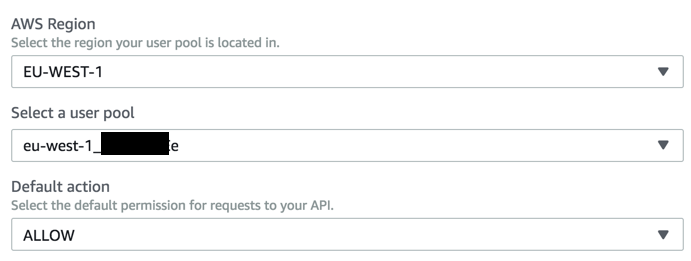
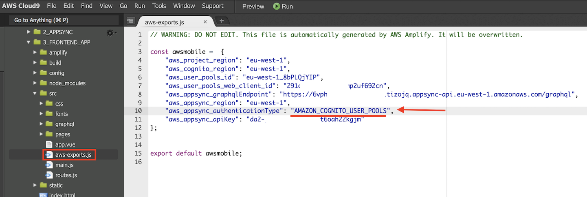

# Module 4: Frontend VueJS application

In this module, we will configure the frontend VueJS application to use AWS Appsync and Amazon Cognito for Authentication. We will use AWS Amplify, a Javascript library, that does the heavy lifting and building web and mobile application really simple.

- [1. Install dependencies and AWS Amplify](#1-Install-dependencies-and-AWS-Amplify)
- [2. Initalize AmplifyJS](#2-Initalize-AmplifyJS)
- [3. Setup Cognito Authentication](#3-Setup-Cognito-Authentication)
- [4. Generate the AppSync Code](#4-Generate-the-AppSync-Code)
- [5. Setup AppSync Authorization Type](#5-Setup-AppSync-Authorization-Type)
- [6. Run the app within AWS Cloud9](#6-Run-the-app-within-AWS-Cloud9)


### 1. Install dependencies and AWS Amplify

- Go to AWS Cloud9 terminal and type the following command. Please ensure you are in the correct directory `aws-appsync-calorie-tracker-workshop/4_FRONTEND_APP`
``` bash
$ cd 4_FRONTEND_APP/ && npm install
```


Next, install and configure [AWS Amplify](https://aws-amplify.github.io/). AWS Amplify includes:

* a JavaScript library with support for React Native and web frameworks including 
React, Angular, Vue and Ionic
* a style guide including UI components
* the Amplify CLI with support for managing the serverless backend, web hosting, and codegen

Start by running:

``` bash
$ npm install -g @aws-amplify/cli
$ amplify configure
```

- Follow the onscreen instructions to configure your environmental settings and create an IAM User for the Amplify service. Make sure to set the default region to the same region where the AppSync and Neptune were created in previous steps i.e  `eu-west-1`
-

- Click/Open the AWS Console link which takes you into Add User within AWS console. Choose `user name`, Access type `programmatic access` and Click `Next Permissions`.
- Add `AdministratorAccess` Policy and Create User.
- Please ensure you make a note of `Access Key Id` and `Secret Access Key`. Please DO NOT share this with anyone.
- In your AWS C9 terminal, click enter and you will be prompted to enter `Access Key Id` and `Secret Access Key`


### 2. Initalize AmplifyJS

From the root of the app directory run:

``` bash
$ amplify init
```

Follow the onscreen questions.
- Choose default editor: `Choose anything`
- Choose the type of app that you're building: `javascript`
- What javascript framework are you using: `vue`
- Source Directory Path: `src`
- Distribution Directory Path: `www`
- Build Command: `npm run build`
- Start Command: `npm start`
- Do you want to use an AWS profile?: `Yes`


After you've chosen the AWS Profile you'd like to use for this project, Amplify will sync between the project to the cloud.


### 3. Setup Cognito Authentication

The app is now ready to run, but it won't be able to do much without an authentication backend. Luckily, Amplify can create a Cognito User Pool for us and point the client-side code to use it.

To add Cognito authentication, run:

```bash
$ amplify add auth
```

- Do you want to use the default authentication and security configuration? `No, I will set up my own configuration`
- Select the authentication/authorization services that you want to use: `User Sign-Up & Sign-In only (Best used with a cloud API only)`
- Please provide a friendly name for your resource: `default`
- Please provide a name for your user pool: `default`
- Multifactor authentication (MFA) user login options: `OFF`
- Email based user registration/forgot password: `Enabled`
- Please specify an email verification subject: `Your verification code`
- Please specify an email verification message: `Your verification code is {####}`
- Do you want to override the default password policy for this User Pool? `No`
- Userpool users are created with a standard set of attributes: `default`
- Specify the app's refresh token expiration period: `30`
- Do you want to specify the user attributes: `No`

The end result should look something like this:


Once complete, the Amplify client-side library is configured to point all Auth API requests to the Cognito Pool we've just created.

But, wait a minute! We haven't created anything aside for a bunch of local configuration files and a Cloudformation template. See `./amplify/backend/auth/{{labelname}}/` for the full details.


To create the Cognito endpoint we've just configured in your AWS account simply run:

```bash
$ amplify push auth
```

The Cloudformation template will take about a minute or two to run, and once done the app should be able to authenticate and register new users since Amplify is now pointing our local code to point at the newly created Cognito Pool!


Pop over to the AWS Console if you'd like to take a better look at the newly created Cognito User Pool. 

### 4. Generate the AppSync Code

In the previous step we added Cognito Authentication to our app. The next step would be to generate the AppSync Queries, Mutations and Subscriptions for us by parsing the AppSync GraphQL Schema in the AWS Account.

Go to the [AWS AppSync Console](https://console.aws.amazon.com/appsync/home) and scroll to the `"Integrate Your App"` section and choosing the `JavaScript option`, then copy the codegen code snippet.


Click through the onscreen options:


Viola! Amplify just fetched all avaliable queries, mutations ans subscriptions from our AppSync Schema and generated their respective code snippets in the `src/graphql` folder. Browse to this folder with your favourite IDE, we'll need to add 2 queries that Amplify did not generate.

Open the `src/graphql/queries.js` file and add the following queries:

#### getUserBmi:

```javascript
export const getUserBmi = `query getUser($id: String!) {
  getUser(id: $id) {
    bmi
  }
}`
``` 

#### ListActivityCategories:

```javascript
export const listActivityCategoriesOnly = `query ListActivityCategories(
  $filter: TableActivityCategoryFilterInput
  $limit: Int
  $nextToken: String
) {
  listActivityCategories(
    filter: $filter
    limit: $limit
    nextToken: $nextToken
  ) {
    items {
      category
    }
    nextToken
  }
}
`;
```

There would be some scenarios where the client-side code would only need to fetch specific values for specific parameters. 

In REST-based APIs this could be achieved in two eays: 

1. Getting all available fields and then cherry picking the necessary values on the clide-side. This solution should work, however it is not cost effective and may not scale well when you'll have millions (or more!) of concurrent clients polling your API for data.

2. Making a server-side change to the API by adding an additional GET query to return only the necessary parameters that are needed. This solution is effective, but it also complicated your development cycles, as each of these changes would require a production change to your APIs.

Luckily this is not an issue with GraphQL. As you can see in the queries we've added above, we can specify which parameters should be returned at runtime. No performance penalty, no changes to our precious production API.

Once the additional queries were added, Save the `queries.js` file and return to the AWS Console.

### 5. Setup AppSync Authorization Type

Using a public API key can be quite useful for various use-cases, but in our case we would like to lock it down to specific users and keep permissions as granular as possible. For example, we wouldn't want to allow  User A to access or modify data related to User B.

We will be leveraging the Cognito User Pool we've created earlier for autorization. 

- Navigate to the AWS AppSync Console's `Settings` page and change the Authorization type to `Amazon Cognito User Pool`:


- Select the relevant region and user pool at the newly revealed "User Pool configuration" section. Default action should be set to `ALLOW`:


- Click the `Save` button to save and apply changes. Once done the AppSync Endpoint should only accept requests containing valid tokens in respect to the configured Cognito User Pool.

Let's configure our frontend code to send the authentication and authorization tokens with every AWS AppSync API call. Since we're using AWS Amplify this would only require a one line change. 

> Edit the `src/aws-exports.js` file and change the `"aws_appsync_authenticationType"` value to `"AMAZON_COGNITO_USER_POOLS"` and save the changes:



Right, so now our AppSync Endpoint will only accept requests from Cognito-authenticated users. This is an important first step towards securing our API, however we're still missing granular access control. Or are we?

Consider the `deleteActivity` mutation resolver template:

```json
{
  "version": "2017-02-28",
  "operation": "DeleteItem",
  "key": {
    "id": $util.dynamodb.toDynamoDBJson($ctx.args.input.id),
  },
  "condition" : {
  	"expression": "userid = :expectedUserid",
    "expressionValues" : {
    	":expectedUserid" : { "S" : "${context.identity.sub}" }
    }
  }
}
```

As you can see, there's a condition in place that should restrict users for deleting only activities that are associated with their unique id.

The same applies for the `listActivities` query resolver template:

```json
{
  "version": "2017-02-28",
    "operation": "Scan",
    "filter" : {
      "expression": "userid = :i",
      "expressionValues": {
          ":i" : { "S" : "${context.identity.sub}" }
        }
    }
}
```

The filter ensures that when the query is executed it should only return activities that are associated with the requesting user's unique id.

There are many additional ways to lock-down and secure your AWS AppSync APIs. See the [AWS AppSync Developer's Guide](https://docs.aws.amazon.com/appsync/latest/devguide/security.html#amazon-cognito-user-pools-authorization) for additional details. 

### 6. Run the app within AWS Cloud9

- Open the `4_FRONTEND_APP/buid/webpack.dev.conf.js` file and add the entry under devServer

```
public: '06ef390e4f5e480eb483a9bdc7a5974a.vfs.cloud9.eu-west-1.amazonaws.com',
```

where `06ef390e4f5e480eb483a9bdc7a5974a` is the ID that AWS Cloud9 assigns to the environment. Please update the ID corresponding to your C9 environment. This can be found in AWS Cloud9 Environment details.

- To start the app in development mode, run:

```bash
$ npm start
```

After Webpack is done arranging the compiling all of the App's assests, you should be seeing the following message:


Since we're building a mobile app, we would recommend using your browser's development toolbar to mimic an actual iPhone 6 device screen:


Next, [lets test the application, shall we?](../5_TESTING/README.md)

[Back to home page](../README.md)