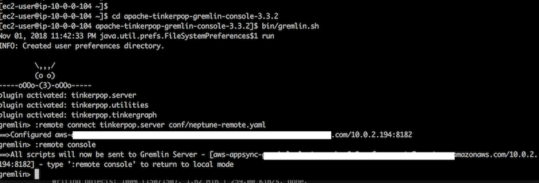
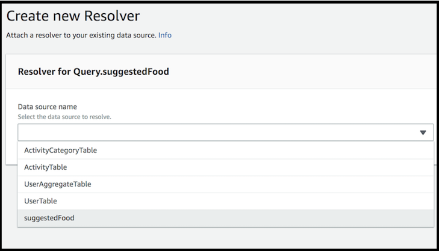

# Module 5: Configuring the App to provide the Food suggestions

Now that you have got an Amazon Neptune cluster and AWS Cloud9 environment setup, lets load the dataset into our Neptune Cluster.

Steps:
- [1.1. Create S3 VPC Endpoint](#11-create-amazon-s3-vpc-endpoint)
- [1.2. Load the dataset into Neptune](#12-load-the-given-food-dataset-into-amazon-neptune)
- [1.3. Test Food-Suggestor Lambda function](#13-test-food-suggestor-lambda-function)
- [1.4. Wiring everything together](#14-Wiring-everything-together)

## 1.1. Create Amazon S3 VPC Endpoint

> Amazon Neptune provides a process for loading data from external files directly into a Neptune DB instance. The Neptune Loader command is faster, has less overhead, is optimized for large datasets, and supports both RDF (Resource Description Framework) and Gremlin data. The Neptune loader requires a VPC endpoint for Amazon S3.

1. Sign in to the AWS Management Console and open the Amazon VPC console at https://console.aws.amazon.com/vpc/.

2. In the left navigation pane, choose Endpoints.

3. Choose Create Endpoint.

4. Choose the Service Name `com.amazonaws.eu-west-1.s3`.

5. Choose the VPC that contains your Neptune DB instance.

6. Select the route tables that are associated with the private subnet related to your cluster.

  

7. Under `Policy`, select `custom`, copy and paste the following policy. Make sure you replace the YOUR_BUCKET_NAME_HERE with the S3 Bucket that you created in Module 0 (check **reinvent-calorietracker-module0** outputs). 

  ```json
{
    "Version": "2012-10-17",
    "Statement": [
        {
            "Effect": "Allow",
            "Principal": "*",
            "Action": [
                "s3:GetObject",
                "s3:PutObject",
                "s3:ListBucket",
                "s3:GetBucketLocation"
            ],
            "Resource": [
                "arn:aws:s3:::S3_BUCKET_NAME_HERE",
                "arn:aws:s3:::S3_BUCKET_NAME_HERE/*"
            ]
        }
    ]
}
  ```

8. Create Endpoint.

----------

## 1.2. Load the given food dataset into Amazon Neptune

In this workshop, we are using a mock data similar to the Health and Nutrition Dataset provided by the [Center for Disease Control and Preventation](https://wwwn.cdc.gov/nchs/nhanes/search/datapage.aspx?Component=Dietary&CycleBeginYear=2015). NHANES conducts studies designed to assess the health and nutritional status of adults and children in the United States. 

The datasets that needs to be loaded into Amazon Neptune are available under the `datasets` folder.

- `Vertex.csv` contains userId, demographics information about the user such as weight (kg), height (cm) and their BMI.

- `food_edges.txt` contains the gremlin queries that creates the edges/relationships between the vertices.
-----

**Step 1:** Go to `EC2 console` and SSH into the EC2 instance named `Neptune-reinvent-calorie-tracker` and copy the below curl command

> Replace the `NEPTUNE_LOADER_ENDPOINT_HERE`, `S3_BUCKET_NAME_HERE` and `IAM_ROLE_ARN_HERE`. You can find these under `reinvent-calorietracker-module0` Cloudformation stack outputs

  

  ```
curl -X POST \
    -H 'Content-Type: application/json' \
    NEPTUNE_LOADER_ENDPOINT_HERE -d '
    {
      "source" : "s3://S3_BUCKET_NAME_HERE/vertex.csv",
      "iamRoleArn" : "IAM_ROLE_ARN_HERE",
      "format" : "csv",
      "region" : "eu-west-1",
      "failOnError" : "FALSE"
    }'
  ```


  


---
You can check the status of your load with the following command. Replace the `NEPTUNE_LOADER_ENDPOINT_HERE`, `LOAD_ID_HERE` and run the command. Ensure the `status` is **LOAD_COMPLETED** as shown in the picture below

  ```
curl NEPTUNE_LOADER_ENDPOINT_HERE?loadId=LOAD_ID_HERE
  ```
Your command should look something like 
```
curl http://reinvent-calorie-tracker.cluster-5v2bkf.eu-west-1.neptune.amazonaws.com:8182/loader?loadId=1a21c028-0f8f-4fc8-b480-77a7258
```

  


**Step 2:** Next, copy and paste the following into your `EC2 terminal`

  ```
cd apache-tinkerpop-gremlin-console-3.3.2
bin/gremlin.sh
:remote connect tinkerpop.server conf/neptune-remote.yaml
:remote console
  ```

  

**Step 3:**  In **Step 1**, we loaded all the vertices. Here we would be creating the edges or relationship between the person, actvity and the food they consumed.

Copy and paste all the queries from `5_NEPTUNE_SUGGESTIONS/datasets/food_edges.txt` into the gremlin console

  

---
### Test the gremlin queries:

Let's run some gremlin queries in the gremlin terminal to verify that the data is loaded correctly and the relationships between that data is created appropriately.

**Query 1:** Prints all the Vertices
  ```
gremlin> g.V().count()
==>80
  ```

> IMPORTANT: In case the count is not 80, please make sure `Step 3` under 1.2 is executed correctly.

**Query 2:** Returns the list of users whose BMI < 24

  ```
gremlin> g.V().has('bmi',lte(24))
==>v[83740]
==>v[83739]
==>v[83748]
==>v[83760]
==>v[83738]
==>v[83751]
==>v[83756]
  ```

**Sample edges (limit 5)**
  ```
gremlin> g.E().limit(5)
==>e[2eb368d5-b6b9-7e5b-8842-4b279c41489b][83744-has->Dinner]
==>e[56b368d5-b6f4-2021-2d1e-128ddfa2db91][83745-has->Lunch]
==>e[34b368d5-b6f5-ac2f-7edf-2498d19004e3][Lunch-eats->4eb368d5-b6f4-b035-d5e2-376d083f1d82]
==>e[22b368d5-b6c3-74f7-04d0-b24bbaa54dfb][Dinner-eats->98b368d5-b6c0-3903-407a-f84d3f243720]
  ```

Can you write a gremlin query to get the names of food consumed by one of the user/person say userid=83744

  ```
gremlin> g.V("83744").out('has').out('eats').values('name')
==>Sandwiches combined with salads
==>Sandwiches combined with Coffee, tea with: milk, cream, sugar
==>Frozen meals combined with Cereals with: milk, sugar, fruit, butter.
==>Sandwiches combined with salads
==>Sandwiches combined with salads
==>Sandwiches combined with Coffee, tea with: milk, cream, sugar
==>salads
==>Rice, pasta, spaghetti, eggs, other mixtures with: butter, gravy, sauce, condiments. combined with salads
==>Sandwiches combined with salads
==>Sandwiches combined with Coffee, tea with: milk, cream, sugar
==>Sandwiches combined with Coffee, tea with: milk, cream, sugar
==>salads
==>Frozen meals combined with Cereals with: milk, sugar, fruit, butter.
==>Rice, pasta, spaghetti, eggs, other mixtures with: butter, gravy, sauce, condiments. combined with salads
  ```

----

## 1.3. Test Food-Suggestor lambda function.

Under AWS lambda, you will find a Lambda function named **suggest-food-for-user**. This is essentially running the following gremlin query where:

- gremlin is traversing the vertex with label **perso** and has a property **bmi** less than or equal to 24.
- Get the outgoing traversal with edges as **has** and label it as **category**.
- In the same way, get the outgoing traversal with edges as **eats**.
- Then filter the results where calories is less than 400, sugar is less than 2 gm, return the **name** of food types that match this criteria and label the output as **type**.
- Select the objects labels **category** and **type** from the path and remove (*dedup*) any repeated items.

	```
  g.V().has('person','bmi',lte(24)).
    out('has').as('category').
    out('eats').
    has('calorie',lt(400)).
    has('sugar',lt(2)).as('type').
    select('category','type').by(id()).by('name').dedup()
	```

- In order to test this Lambda function, copy the following as test input

	```
	{
	  "bmi": 24,
	  "calorie": 400,
	  "sugar": 2,
	  "userid": "83740"
	}
	```

  

- Enter a new event name and click `create`.

  

- Test the lambda function which should return a list of suggested food based on the given BMI


## 1.4. Wiring everything together

#### Step 1: Setup a new Appsync Data source:

1. Go to AWS AppSync console, `data source`.


2. Click `New`, Data Source Name: `suggestedFood`
3. Data Source type as `AWS Lambda function`
4. Region: `EU-WEST-1` and function ARN as `suggested-food-for-user`
5. Create a new role and click `Create`

#### Step 2: Adding suggestedFood query to Appsync schema:
1. Under your Appsync schema, locate `type Query`, ensure you have `suggestedFood` query. If not, please add the following after `listUsers` and `Save Schema`.

```
	suggestedFood(
		bmi: Float,
		calorie: Float,
		sugar: Float,
		userid: String!
	): [Activity]

```
2. Under `Resolvers` in the right pane, locate suggestedFood


3. Click Attach
4. `Create a New Resolver`
5. Select `suggestedFood` data source that was created in Step 1



6. Save Resolver.

#### Step 3: Updating the graphql schema in your code:

Within `3_FRONTEND_APP/src/graphql/queries.js`, update the `suggestedFood` schema to return only category and type. Save the code change.

```Javascript
export const suggestedFood = `query SuggestedFood(
  $userid: String!
  $bmi: Float
  $calorie: Float
  $sugar: Float
) {
  suggestedFood(userid: $userid, bmi: $bmi, calorie: $calorie, sugar: $sugar) {
    category
    type
  }
}`;
```

Start the application and should see the suggestions being returned

```bash
$ npm start
```


# Summary

**Congratulations!!!**  You now have a fully fledged app that allows you to register, set a goal and provide food suggestions. 

###  Build app for production

We will be using AWS Amplify to build, push and host our app on S3. Simply run within your Cloud9 terminal:

```
$ amplify add hosting
```

And pick 'PROD' as the environment and leave all other options at their default value. 

Once you're ready, run the `$ amplify publish` command. Amplify will then build the app using Webpack, upload the assests to the designated S3 Bucket and setup all the necessary configuration and permissions to host the app on that bucket. As a bonus we also get Cloudfront in front of the bucket to cache all the static assests (HTML, JavaScript, etc.) and make our app blazing fast!

You should see something similar to this message once done:


The app is now live in production.

---
### Other Ideas:

You are welcome to contribute and add features to this app to make it fun learning app about AWS AppSync, Amazon Neptune, AWS Amplify or any other services. Below are some of the ideas:

- Login using Cognito's Federated Auth - Facebook
- Fine tune the gremlin query to provide personalized suggestions using Machine Learning
- Offline capability.

[Closing and Clean-up](../6_CLEANUP/README.md)

[Back to home page](../README.md)
